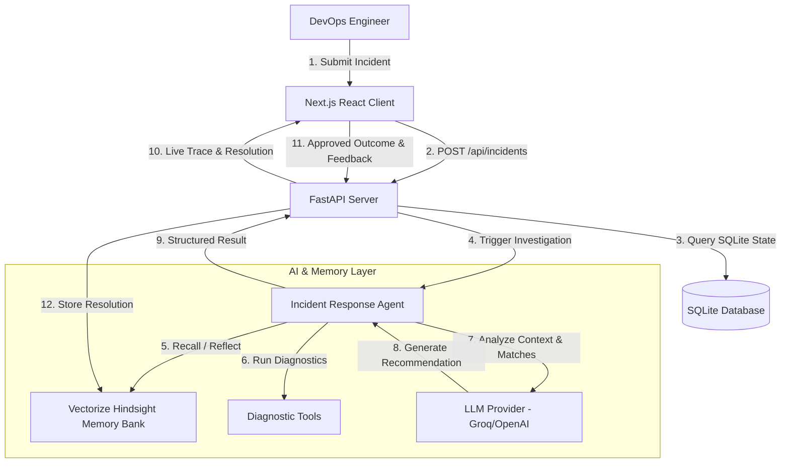

# OpsMemory AI Architecture

## Overview
OpsMemory AI is a professional AI-driven incident response agent that leverages **Vectorize Hindsight** as its core long-term memory engine. 

## Component Diagram

## Core Workflows

### 1. Incident Creation & Analysis
- When an incident is logged, the backend creates a structured ticket in SQLite.
- The Agent queries Hindsight with the incident symptoms and error messages.
- Hindsight searches across **semantic, keyword, entity-graph, and temporal dimensions** to retrieve previous matching outages.

### 2. Feedback & Memory Consolidation
- When an engineer confirms a recommendation as helpful, the successful recovery steps are written back to Hindsight using the `/v1/default/banks/{bank_id}/memories` endpoint.
- Hindsight automatically consolidates these raw experience facts into high-level operational rules (Observations) over time.

---

🤖 Generated with [Claude Code](https://claude.com/claude-code)
Co-Authored-By: Claude Code <noreply@anthropic.com>
